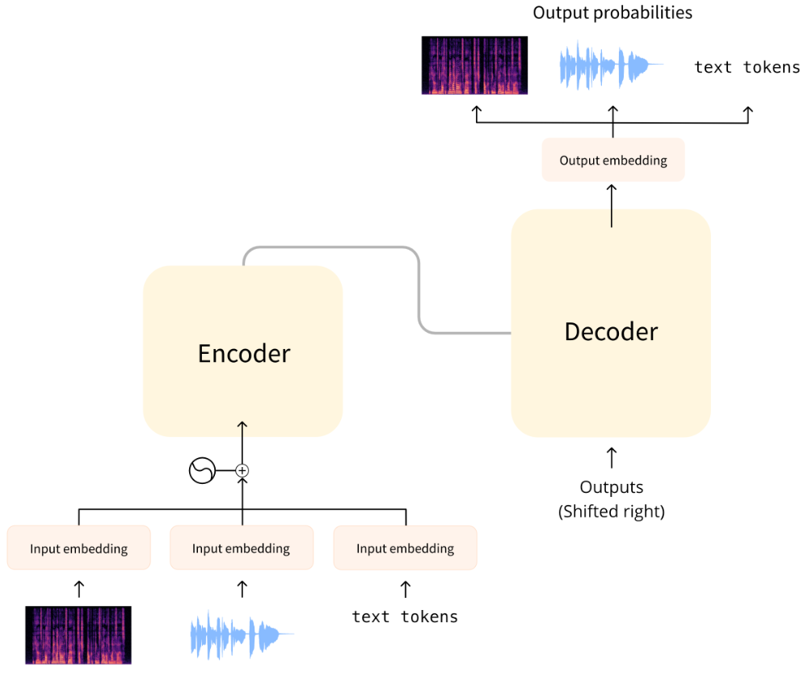

# Unit 3. Transformer architectures for audio

 **Transformers are one of the most revolutionary advancements in AI** . Originally introduced by Google researchers in  **2017** , the Transformer architecture was designed for  **natural language processing (NLP)** , particularly in  **machine translation** .


### **Key Components of the Transformer:**

1. **Encoder** – Extracts meaningful features from the input.
2. **Decoder** – Generates the output based on the encoded features.

### **How Transformers Process Input Data**

1. **Tokenization** – The input (text or audio) is divided into smaller units (tokens).
2. **Embedding Extraction** – The tokens are converted into vector representations.
3. **Encoding & Decoding** – The embeddings are passed through the Transformer model.

# **Transformers for Audio Processing**

The same Transformer architecture can be applied to **audio tasks** like:

* **Text-to-Speech (TTS)** – Converting text into speech.
* **Automatic Speech Recognition (ASR)** – Converting speech into text.

### **Differences Between Text and Audio Processing**

Unlike NLP tasks, where the input is  **text tokens** , audio processing requires additional steps:

* **Preprocessing** :
* Convert raw waveforms into **spectrograms** or other audio representations.
* **Post-processing** :
* Convert model output back into **text** (ASR) or **waveforms** (TTS).
* **Task-Specific Adjustments** :
* The  **input format** ,  **training data** , and **loss functions** differ based on whether the task is  **speech recognition, synthesis, or classification** .




# CTC architectures (Connectionist Temporal Classification)


### **Refined Explanation of CTC Architectures in ASR**

#### **1️⃣ How CTC Works in ASR**

* The audio is divided into small segments of **20ms** each.
* Due to  **overlapping** , each segment actually represents **25ms** of audio.
* The **encoder processes each segment** and outputs **hidden states** (representations of sound).
* For  **one second of audio** , the encoder generates  **50 hidden states** , each with a size of approximately **768** (or another embedding size).
* These **hidden states** are passed to a  **CTC head (a linear layer)** , which converts them into  **logits** .
* The output is a  **(50, 32) tensor** , where **32** is the number of possible tokens in the vocabulary (letters, punctuation, etc.).

---

#### **2️⃣ Why Does the Model Output Repeated Characters?**

Since  **speech and text are not perfectly aligned** , the model often **repeats** characters in its predictions.

Example of raw output before processing:

```
BRIIONSAWWSOMEETHINGCLOSETOPANICONHHISOPPONENT'SSFAACEWHENTHEMANNFINALLLYRREECOGGNNIIZEDHHISSERRRRORR
```

This occurs due to:

* **Overlapping frames** , which cause some phonemes to appear multiple times.
* The model predicting sounds independently for each frame, leading to  **repeated letters** .
* Some extra **noisy outputs** due to model uncertainty.

---

#### **3️⃣ How CTC Fixes This**

CTC introduces a special **"blank" token (`_`)** to help align characters properly.

Blank token is a predicted token that serves as a hard boundary between groups of characters. It makes it possible to filter out the duplicate characters

* If a letter is **repeated** but has a blank (`_`) between them, only one instance is kept.
* If a letter appears  **consecutively** , the duplicates are removed.

Example after applying CTC decoding:

```
B_R_II_O_N_||_S_AWW_|||||_S_OMEE_TH_ING_||_C_L_O_S_E||TO|_P_A_N_I_C_||_ON||HHI_S||_OP_P_O_N_EN_T_'SS||_F_AA_C_E||_W_H_EN||THE||M_A_NN_||||_F_I_N_AL_LL_Y||||_RREE_C_O_GG_NN_II_Z_ED|||HHISS|||_ER_RRR_ORR||||
```

After final processing:

```
BRION SAW SOMETHING CLOSE TO PANIC ON HIS OPPONENT'S FACE WHEN THE MAN FINALLY RECOGNIZED HIS ERROR
```

CTC removes duplicates and blank tokens to produce a readable text output.

---

#### **4️⃣ Correcting Spelling Errors with a Language Model**

Even after CTC processing, some words may be **misspelled** (e.g., "RECOGGNNIIZED" instead of "RECOGNIZED").

* To address this, a **language model (LM)** is added on top of CTC.
* The LM helps **correct spelling and grammar mistakes** by predicting **more likely words** based on context.

Example of improvement:

* **CTC output:** `"REC OGGNNIIZED"`
* **CTC + Language Model output:** `"RECOGNIZED"`

---

#### **5️⃣ How is the Encoder Trained?**

The encoder can be trained using different strategies, such as:

* **Masked training** (similar to Wav2Vec2)
* **Contrastive learning**
* **Self-supervised learning (HuBERT)**

---

### **Summary**

* **CTC aligns audio with text** by introducing blank tokens and removing duplicates.
* **The model often outputs repeated letters** , which CTC corrects.
* **A language model can refine the output further by fixing spelling mistakes.**
* **The encoder can be trained using different self-supervised learning techniques.**


# Seq2Seq architectures


Seq2Seq models use  **both an encoder and a decoder** , making them more powerful than **CTC-based** models but also **slower** due to their iterative decoding process.

---

### **1. Seq2Seq for ASR (Automatic Speech Recognition)**

* The **encoder** processes the input **audio** and extracts **hidden states** for each small segment.
* The **decoder** uses these hidden states through **cross-attention** and **iteratively generates** text tokens.

#### **Key Differences from CTC**

✅  **Decoding is iterative** : Instead of predicting all characters at once (as in CTC), the decoder starts with a **special start token** and generates one token at a time.
✅  **Autoregressive nature** : Each predicted token is **fed back into the decoder** to generate the next token.
✅  **More accurate than CTC** , but **slower** due to sequential processing.

#### **Metrics & Loss**

* **Loss** : Typically  **Cross-Entropy Loss** .
* **Metric** :  **WER (Word Error Rate)** , which measures how different the predicted text is from the actual text.

---

### **2. Seq2Seq for TTS (Text-to-Speech)**

* The **encoder** takes **text input** and converts it into  **hidden representations** .
* The **decoder** generates **audio features** (e.g., spectrograms)  **step by step** , similar to how ASR works but in reverse.
* For transformer model that produces spectrograms, a **vocoder** (e.g., WaveNet, HiFi-GAN) is **needed** to convert the generated spectrograms into a waveform. The vocoder is trained separately and is **not part of the transformer architecture** itself.

#### **Key Challenges in TTS**

* Unlike ASR, where text is fixed, **speech varies** in  **tone, emotion, gender, speed, and accent** , making TTS more complex.
* The **decoder starts with an initial spectrogram filled with zeros** and iteratively **generates** audio frames.
* Some models also include a  **separate sequence to predict when to stop generation** .

#### **Metrics & Loss**

* **Loss** : **L1 loss, L2 loss, or Mel-spectrogram loss** (to ensure realistic speech synthesis).
* **Metric** :  **MOS (Mean Opinion Score)** , based on human evaluation.


# Audio classification architectures


AST **Audio Spectrogram Transformer (is an encoder-only transformer)**

* **Treating Audio as an Image**
  * Since CNNs and transformers work well on images, we can **convert audio into a spectrogram** (a visual representation of sound frequencies over time).
  * Then, we **process the spectrogram as an image** for classification.
* **Using Transformers for Audio (AST - Audio Spectrogram Transformer)**
  * Instead of using a  **CNN** , we can use a  **Vision Transformer (ViT) for audio** .
  * The spectrogram is divided into **overlapping patches** (e.g., 16×16 pixels).
  * Each patch is  **embedded into a vector representation** .
  * **Positional encodings** are added to retain the order of patches.
  * These embeddings are passed through a  **Transformer Encoder** .
* **Classification Methods**
  * The **hidden states** from the encoder are passed to a **classification head (linear + softmax)** to predict the class probabilities.
  * There are **two ways** to get the final classification:
    * **Per time-step classification:** Use all hidden states and predict a label for each time period.
    * **Single classification for the whole sequence:** Take the **average** of the hidden states and predict one class for the entire audio clip.
* **Generalization to Other Models**
  * Any encoder-based model (e.g., CTC models) can be **converted into a classification model** by:
    * Adjusting the output size to  **match the number of classes** .
    * Replacing **CTC loss** with **cross-entropy loss** (log classification loss).
